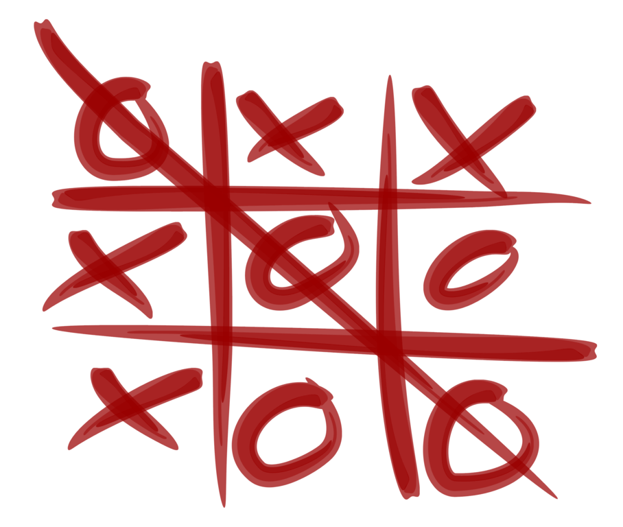

# Tic Tac Toe played by Double Deep Q-Networks

 
 This repository contains a (successful) attempt to train a Double Deep Q-Network (DDQN)
 agent to play Tic-Tac-Toe. It learned to:
 
 * Distinguish valid from invalid moves
 * Comprehend how to win a game
 * Block the opponent when poses a threat
 
## Key formulas of algorithms used: 
### Double Deep Q-Networks:
Based on the DDQN algorithm by Van-Hasselt _et al._ [[1]](#ref1). The cost function used is:

Where θ represents the trained Q-Network and ϑ represents the semi-static Q-Target
network.

The Q-Target update rule is based on the DDPG algorithm by Lillicrap _et al._ [[2]](#ref2) :

for some 0 <= τ <= 1. 

### Maximum Entropy Learning:
Based on a paper by Haarnoja _et al_.[[3]](#ref3) and designed according to 
a blog-post by BAIR[[4]](#ref4). 
Q-Values are computed using the Soft Bellman Equation:
 
 
## Trained models:
Two types of agents were trained: 
* a regular DDQN agent
* an agent which learns using maximum entropy. They are named _'Q'_ and _'E'_ respectively.
 
Both models use a cyclic memory buffer as their experience-replay memory.

All pre-trained models are found under the `models/` directory, where several trained models can be found for each 
variant. _Q_ files refer to DDQN models and _E_ files refer to DDQN-Max-Entropy models.  

## Do it yourself:
The `main.py` holds several useful functions. See doc-strings for more details:
* `train` will initiate a single training process. It will save the weights and plots graphs. 
Using the current settings, training took me around 70 minutes on a 2018 MacBook Pro
* `multi_train` will train several DDQN and DDQN-Max-Entropy models
* `play` allows a human player to play against a saved model
* `face_off` can be used to compare models by letting them play against each other

The `DeepQNetworkModel` class can be easily configured using these parameters (among others):
* `layers_size`: set the number and size of the hidden layers of the model (only fully-connected layers are supported)
* `memory`: set memory type (cyclic buffer or reservoir sampling)
* `double_dqn`: set whether to use DDQN or a standard DQN
* `maximize_entropy`: set whether to use maximum entropy learning or not

See the class doc-string for all possible parameters.  

---------------------------

### Related blogposts:
* Read about where I got stuck when developing this code on "[Lessons Learned from Tic-Tac-Toe: Practical Reinforcement Learning Tips](https://medium.com/@shakedzy/lessons-learned-from-tic-tac-toe-practical-reinforcement-learning-tips-5cac654a45a8)"
* Read about the _E_ Max-Entropy models on "[Open Minded AI: Improving Performance by Keeping All Options on the Table](https://medium.com/@shakedzy/open-minded-ai-improving-performance-by-keeping-all-options-on-the-table-ddefce50913a)"

---------------------------

### References:

1) Hado van Hasselt _et al._, [Deep Reinforcement Learning with Double Q-learning](https://arxiv.org/abs/1509.06461)

2) Lillicrap _et al._ , [Continuous control with deep reinforcement learning](https://arxiv.org/abs/1509.02971)

3) Haarnoja _et al._, [Reinforcement Learning with Deep Energy-Based Policies](https://arxiv.org/abs/1702.08165)

4) Tang & Haarnoja, [Learning Diverse Skills via Maximum Entropy Deep Reinforcement Learning](https://bair.berkeley.edu/blog/2017/10/06/soft-q-learning/) (blogpost)
